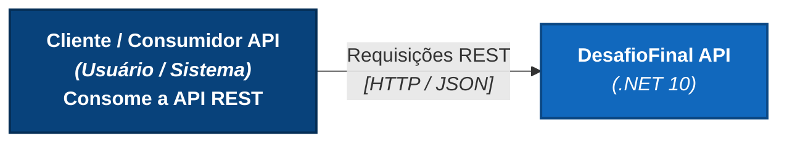
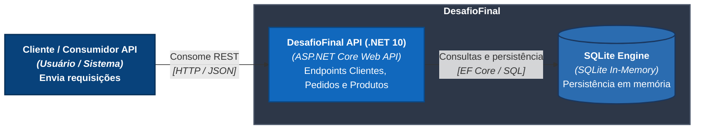
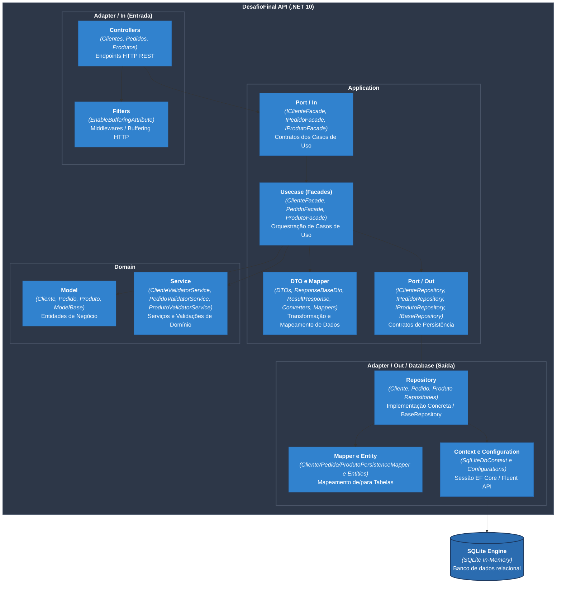

### Arquitetura da API (C4 Model)

#### Nível 1: Diagrama de Contexto

```mermaid
flowchart LR
    classDef boundaryStyle fill:#2d3748,stroke:#4a5568,stroke-width:2px,color:#fff,font-weight:bold;
    classDef actorStyle fill:#08427b,stroke:#052e56,stroke-width:2px,color:#fff,font-weight:bold;
    classDef systemStyle fill:#1168bd,stroke:#0b4884,stroke-width:2px,color:#fff;
    classDef extSystemStyle fill:#2b6cb0,stroke:#1a365d,stroke-width:2px,color:#fff;

    Cliente["<b>Cliente / Consumidor API</b><br/><i>(Usuário / Sistema)</i><br/>Consome a API REST"]
        
    DesafioFinal["<b>DesafioFinal API</b><br/><i>(.NET 10)</i>"]

    class Title boundaryStyle;
    class Cliente actorStyle;
    class DesafioFinal systemStyle;
    class SQLite extSystemStyle;

    Cliente -->|"Requisições REST<br/><i>[HTTP / JSON]</i>"| DesafioFinal
```

#### Nível 2: Diagrama de Contêineres

```mermaid
flowchart LR
    classDef boundaryStyle fill:#2d3748,stroke:#4a5568,stroke-width:2px,color:#fff,font-weight:bold;
    classDef actorStyle fill:#08427b,stroke:#052e56,stroke-width:2px,color:#fff,font-weight:bold;
    classDef containerStyle fill:#1168bd,stroke:#0b4884,stroke-width:2px,color:#fff;
    classDef dbStyle fill:#2b6cb0,stroke:#1a365d,stroke-width:2px,color:#fff;

    Cliente["<b>Cliente / Consumidor API</b><br/><i>(Usuário / Sistema)</i><br/>Envia requisições"]

    subgraph SystemBoundary ["DesafioFinal"]
        API["<b>DesafioFinal API (.NET 10)</b><br/><i>(ASP.NET Core Web API)</i><br/>Endpoints Clientes, Pedidos e Produtos"]
            
        SQLite[("<b>SQLite Engine</b><br/><i>(SQLite In-Memory)</i><br/>Persistência em memória")]
    end

    class Title,SystemBoundary boundaryStyle;
    class Cliente actorStyle;
    class API containerStyle;
    class SQLite dbStyle;

    Cliente -->|"Consome REST<br/><i>[HTTP / JSON]</i>"| API
    API -->|"Consultas e persistência<br/><i>[EF Core / SQL]</i>"| SQLite
```

#### Nível 3: Diagrama de Componentes (Hexagonal / Ports e Adapters)

```mermaid
flowchart TD
    classDef boundaryStyle fill:#2d3748,stroke:#4a5568,stroke-width:2px,color:#fff,font-weight:bold;
    classDef componentStyle fill:#3182ce,stroke:#2b6cb0,stroke-width:1px,color:#fff;
    classDef dbStyle fill:#2b6cb0,stroke:#1a365d,stroke-width:2px,color:#fff;

    subgraph API ["DesafioFinal API (.NET 10)"]
        direction LR

        subgraph Application ["Application"]
            PortsIn["<b>Port / In</b><br/><i>(IClienteFacade, IPedidoFacade, IProdutoFacade)</i><br/>Contratos dos Casos de Uso"]
            Usecases["<b>Usecase (Facades)</b><br/><i>(ClienteFacade, PedidoFacade, ProdutoFacade)</i><br/>Orquestração de Casos de Uso"]
            DTOsMappers["<b>DTO e Mapper</b><br/><i>(DTOs, ResponseBaseDto, ResultResponse, Converters, Mappers)</i><br/>Transformação e Mapeamento de Dados"]
            PortsOut["<b>Port / Out</b><br/><i>(IClienteRepository, IPedidoRepository, IProdutoRepository, IBaseRepository)</i><br/>Contratos de Persistência"]
        end

        subgraph Domain ["Domain"]
            Models["<b>Model</b><br/><i>(Cliente, Pedido, Produto, ModelBase)</i><br/>Entidades de Negócio"]
            Services["<b>Service</b><br/><i>(ClienteValidatorService, PedidoValidatorService, ProdutoValidatorService)</i><br/>Serviços e Validações de Domínio"]
        end

        subgraph AdapterOut ["Adapter / Out / Database (Saída)"]
            Repos["<b>Repository</b><br/><i>(Cliente, Pedido, Produto Repositories)</i><br/>Implementação Concreta / BaseRepository"]
            PersistenceMappers["<b>Mapper e Entity</b><br/><i>(Cliente/Pedido/ProdutoPersistenceMapper e Entities)</i><br/>Mapeamento de/para Tabelas"]
            DbContext["<b>Context e Configuration</b><br/><i>(SqlLiteDbContext e Configurations)</i><br/>Sessão EF Core / Fluent API"]
        end

        subgraph AdapterIn ["Adapter / In (Entrada)"]
            Controllers["<b>Controllers</b><br/><i>(Clientes, Pedidos, Produtos)</i><br/>Endpoints HTTP REST"]
            Filters["<b>Filters</b><br/><i>(EnableBufferingAttribute)</i><br/>Middlewares / Buffering HTTP"]
        end
    end

    SQLite[("<b>SQLite Engine</b><br/><i>(SQLite In-Memory)</i><br/>Banco de dados relacional")]

    class Title,API,AdapterIn,Application,Domain,AdapterOut boundaryStyle;
    class Controllers,Filters,PortsIn,Usecases,DTOsMappers,PortsOut,Models,Services,Repos,PersistenceMappers,DbContext componentStyle;
    class SQLite dbStyle;

    Controllers --> Filters
    Controllers --> PortsIn
    PortsIn --> Usecases
    Usecases --> DTOsMappers
    Usecases --> Models
    Usecases --> Services
    Usecases --> PortsOut
    PortsOut --> Repos
    Repos --> PersistenceMappers
    Repos --> DbContext
    DbContext --> SQLite
```